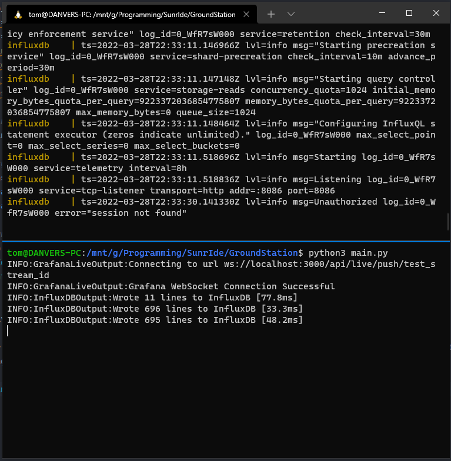
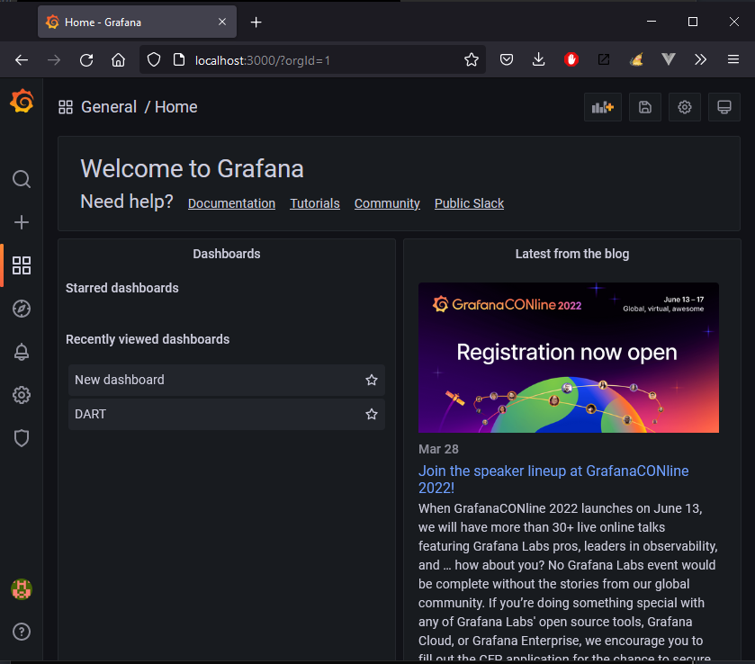
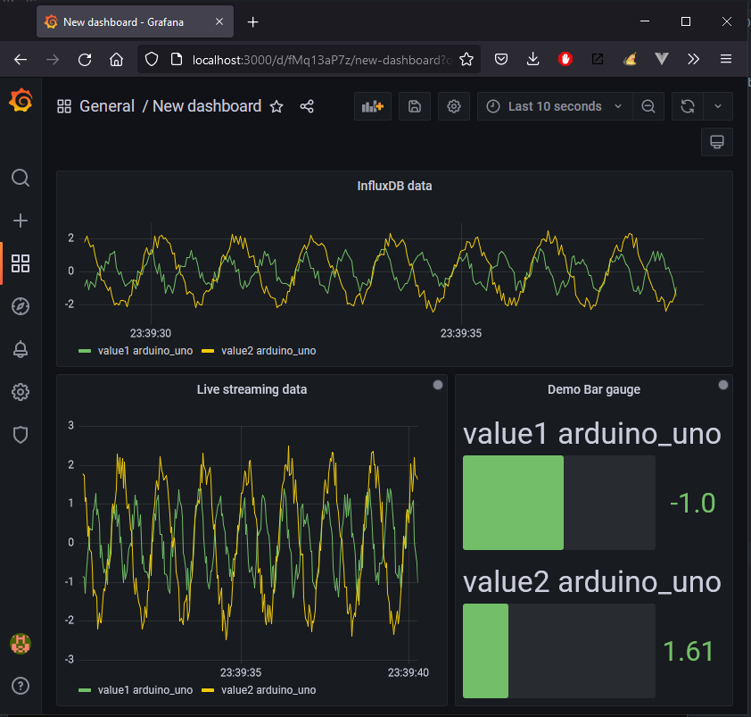
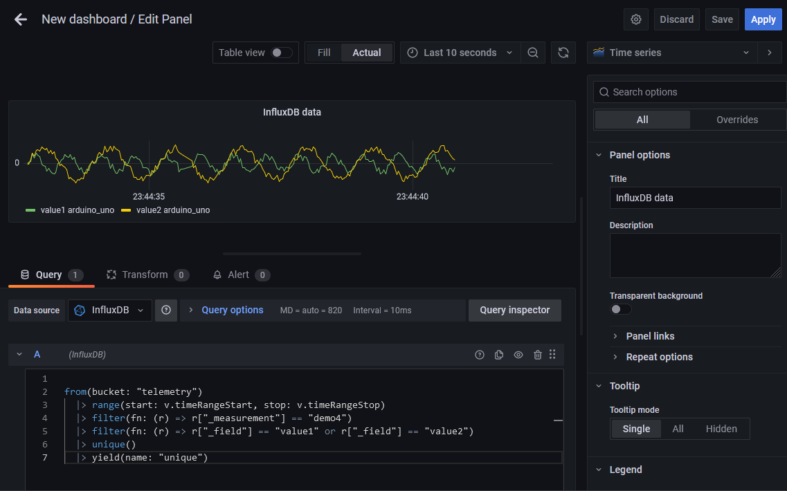
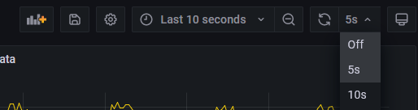
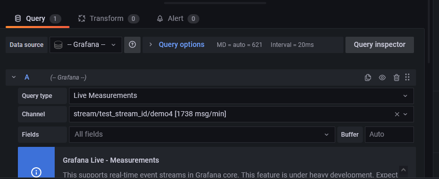

# SunrIde Ground Station Software

In this project, Grafana and InfluxDB are combined to provide a great solution for data visualization and storage.


> [Grafana](https://grafana.com/grafana/) is a multi-platform open source analytics and interactive visualization web
> application. It provides charts, graphs, and alerts for the web when connected to supported data sources.
_Source: [Wikipedia](https://en.wikipedia.org/wiki/Grafana)_

> [InfluxDB]() is an open-source time series database (TSDB) developed by the company InfluxData. It is written in the
> Go programming language for storage and retrieval of time series data in fields such as operations monitoring,
> application metrics, Internet of Things sensor data, and real-time analytics.
_Source: [Wikipedia](https://en.wikipedia.org/wiki/InfluxDB)_

Grafana and InfluxDB are hosted in [Docker Containers](https://www.docker.com/resources/what-container/),
allowing them to run on most platforms with minimal environment setup/configuration.
[Docker Compose](https://docs.docker.com/compose/) is used to run the containers together.

In order to stream data into Grafana and InfluxDB, we send strings of data over a Serial connection from an Arduino
formatted as [InfluxDB Line Protocol](https://docs.influxdata.com/influxdb/v2.1/reference/syntax/line-protocol/).
This is received by a python script, where the data is then sent to Grafana and InfluxDB.

[Grafana Live](https://grafana.com/docs/grafana/latest/live/) is a new feature in Grafana which allows data to be
pushed to the frontend as soon as it occurs. WebSockets are used for this, and it allows us to display real-time graphs
of our data on Grafana's dashboards. However, Grafana is not a database. It does not store data. And if the live data
stream is interrupted, we will lose data. Therefore, we need to use a database such as InfluxDB.

The python script streams data to Grafana over a WebSocket connection, and writes data to InfluxDB in batches. This is
because InfluxDB offers an HTTP API rather than WebSockets, so sending a separate request for each data point would be
inefficient.

## System Architecture Diagram


This ground station system is modular and therefore can easily be expanded. More inputs and outputs can easily be
configured in the python script for very custom use cases, or InfluxDB can be read from within any web-enabled
application. A few examples of possible applications would include:
- Offsite data analysis
- Display of mission data to competition judges in real time
- Live stream of launch with overlay that uses live telemetry data (think SpaceX broadcasts!)

## Python script for connecting inputs to outputs

In order to connect the Serial data input to the Grafana Live and InfluxDB outputs, we use a python script. This has
been built in order to allow multiple inputs and outputs to be connected. We considered the use of some dynamic config
file that allowed the creation of multiple inputs and outputs, but decided it was more flexible to allow the user to
edit the python script directly according to their needs.

In the `gs_server` directory are a set of python classes that should be used to get data from a serial port and send
it to InfluxDB and Grafana.

### Dependencies

This project requires Python 3.7 or higher to be installed. There are some additional dependencies, explained below:

- [websockets](https://websockets.readthedocs.io/en/stable/) - used by the `GrafanaLiveOutput` class to create a
  WebSocket connection with Grafana Live

- [pyserial-asyncio](https://pyserial-asyncio.readthedocs.io/en/latest/) - used by the `SerialLineInput` class to
  read data from the Serial port asynchronously

- [aiohttp](https://docs.aiohttp.org/en/stable/) - used by the `InfluxDBOutput` class for making asynchronous HTTP
  requests to write data to InfluxDB

These can be installed with `pip`, the python package manager, by running the following command:

    pip install websockets pyserial-asyncio aiohttp

### Example script

```python
import logging
from gs_server import *  # import I/O classes from `gs_server` directory
import asyncio

# configure the logging module to output the "INFO" log level
logging.basicConfig(level=logging.INFO)

# create a variable that defines the input timestamp precision
TIMESTAMP_PRECISION = "ms"

# serial_input = SerialLineInput("COM10", 2000000)
serial_input = FakeSerialLineInput()

# define our GrafanaLiveOutput object
grafana_output = GrafanaLiveOutput(
    host="localhost",
    port=3000,
    stream_id="test_stream_id",
    api_token="YOUR_GRAFANA_API_TOKEN",
    timestamp_precision=TIMESTAMP_PRECISION
)
# plug in our GrafanaLiveOutput to our SerialLineInput
serial_input.add_output(grafana_output.input)

# define our InfluxDBOutput object
influxdb_output = InfluxDBOutput(
    host="localhost",
    port=8086,
    org_name="Sunride",
    bucket="telemetry",
    api_token="YOUR_INFLUXDB_API_TOKEN",
    timestamp_precision=TIMESTAMP_PRECISION
)
# plug in our InfluxDBOutput to our SerialLineInput
serial_input.add_output(influxdb_output.input)

# get asyncio event loop and connect the serial/grafana inputs/outputs
loop = asyncio.get_event_loop()
loop.create_task(grafana_output.connect())
loop.create_task(serial_input.connect())
try:
    # run the loop forever
    loop.run_forever()
except KeyboardInterrupt:  # prevent an error from showing when the script is closed
    print("Stopping...")
```

Hopefully it is clear from the above script that more inputs/outputs can be added if required. 

The user can also implement their own inputs/outputs to connect to any other web services that they need to use by 
following a similar pattern.

## Running the ground station

The docker containers for Grafana and InfluxDB can be started by using the following command:

    docker-compose up

If you want to start the containers in detached mode, add the `-d` flag to the command (`docker-compose up -d`)

The python script can then be started:

    python main.py



If the connection is lost to Grafana or InfluxDB, the script will attempt to reconnect.

## Web dashboards

To access the web dashboard for Grafana, we can navigate to `localhost:3000` in our browser

You should be greeted with this page 



In our example, we have this simple dashboard set up. The dashboard contains three elements. 

The top element contains data pulled from InfluxDB. The bottom left element contains live-streaming data from Grafana, 
and so does the bottom right element, just displayed differently.



Please refer to the [grafana documentation](https://grafana.com/docs/grafana/latest/dashboards/) to learn more about 
how to configure these dashboards. Below, we will describe how to set up the influxDB view and Live Streaming view

## Configuring an InfluxDB panel

First, if it has not been added already, you must 
[add InfluxDB as a data source](https://grafana.com/docs/grafana/latest/datasources/influxdb/).

After this, you can write a [Flux query](https://docs.influxdata.com/influxdb/cloud/query-data/get-started/) to query 
the data you want from InfluxDB.
- The InfluxDB web dashboard (accessible at `localhost:8086`) is useful for this, as it can generate Flux queries

Now paste this query into the box as shown below and press 'Apply'



You can use the drop-down in the top right to set the update rate of the InfluxDB-sourced data. Set it to 5 seconds. If 
you are using the Python script to stream data into the system, you should now see it updating!



## Configuring a Grafana Live panel

In order to show live-streaming data, you need to set up a panel that displays 'Live Measurements' from Grafana.

The panel is configured as shown below.



In order for your 'channel' to be an option in the drop-down list, you must first stream some data to Grafana.

More information about Grafana Live channels can be found 
[here](https://grafana.com/docs/grafana/latest/live/live-channel/).

